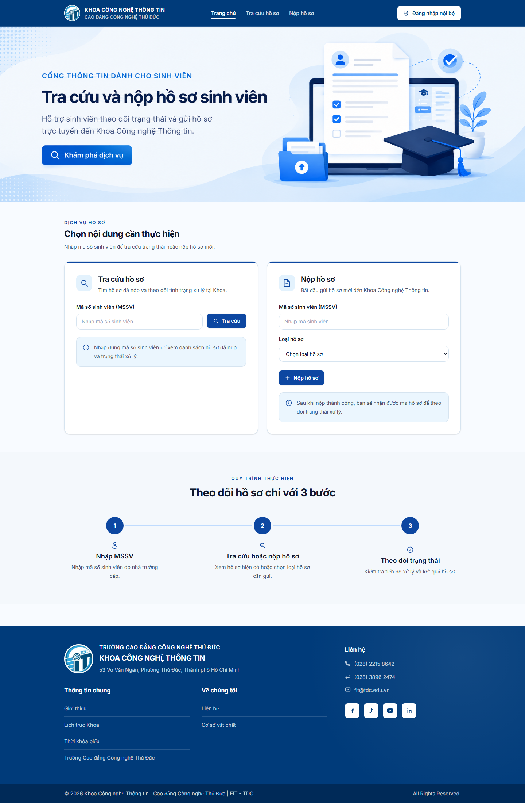
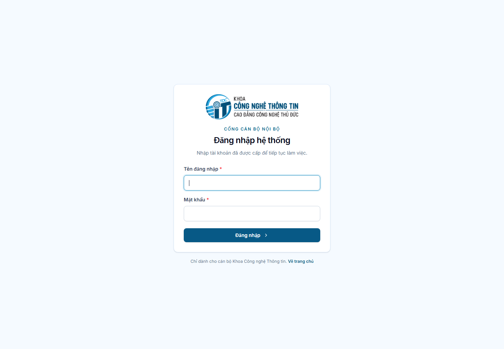

# Hệ thống Quản lý Hồ sơ Sinh viên

Hệ thống hỗ trợ Khoa Công nghệ Thông tin quản lý, phân công,
xử lý và theo dõi hồ sơ sinh viên; đồng thời cung cấp cổng
tra cứu và nộp hồ sơ công khai cho sinh viên.

## Mục lục

- [Giới thiệu](#giới-thiệu)
- [Đối tượng sử dụng](#đối-tượng-sử-dụng)
- [Chức năng chính](#chức-năng-chính)
- [Hướng dẫn dành cho sinh viên](#hướng-dẫn-dành-cho-sinh-viên)
- [Hướng dẫn dành cho Admin](#hướng-dẫn-dành-cho-admin)
- [Hướng dẫn dành cho Thư ký](#hướng-dẫn-dành-cho-thư-ký)
- [Hướng dẫn dành cho Nhân viên](#hướng-dẫn-dành-cho-nhân-viên)
- [Quy trình xử lý hồ sơ](#quy-trình-xử-lý-hồ-sơ)
- [API dành cho Mobile](#api-dành-cho-mobile)
- [Câu hỏi thường gặp](#câu-hỏi-thường-gặp)
- [Lưu ý](#lưu-ý)

## Giới thiệu

Ứng dụng web nội bộ của Khoa Công nghệ Thông tin — Trường Cao đẳng Công nghệ Thủ Đức, dùng để lưu trữ, phân công và theo dõi quá trình xử lý hồ sơ sinh viên.

Hệ thống có hai khu vực:

- **Trang công khai:** sinh viên tra cứu và nộp hồ sơ bằng MSSV, không cần tài khoản.
- **Khu vực nội bộ:** cán bộ đăng nhập bằng tên đăng nhập và mật khẩu để quản lý hồ sơ.

Phiên bản hiện tại không gửi email, không có quên mật khẩu qua email và không đính kèm tệp.



## Đối tượng sử dụng

| Vai trò | Quyền chính |
|---|---|
| Admin (`ADMIN`) | Quản lý toàn hệ thống: người dùng, loại hồ sơ, mọi hồ sơ, báo cáo, nhật ký hoạt động |
| Thư ký (`SECRETARY`) | Xem dashboard toàn hệ thống, tạo/cập nhật hồ sơ, phân công, đổi trạng thái, xem báo cáo |
| Nhân viên (`EMPLOYEE`) | Chỉ xem hồ sơ được phân công; tiếp nhận hồ sơ chờ tiếp nhận; cập nhật ghi chú |
| Sinh viên | Tra cứu và nộp hồ sơ trên trang chủ, không đăng nhập |

Trong cơ sở dữ liệu, vai trò Nhân viên được lưu bằng giá trị `staff`.

## Chức năng chính

- Đăng nhập / đăng xuất nội bộ
- Dashboard (Tổng quan)
- Quản lý người dùng (Admin)
- Quản lý loại hồ sơ (Admin)
- Quản lý hồ sơ sinh viên: tìm kiếm, lọc, tạo, xem, cập nhật
- Phân công người phụ trách
- Tiếp nhận hồ sơ
- Chuyển trạng thái và xem lịch sử trạng thái
- Báo cáo (Admin, Thư ký)
- Nhật ký hoạt động (Admin, chỉ xem)
- Trang công khai: tra cứu hồ sơ theo MSSV
- Trang công khai: nộp hồ sơ
- API JSON công khai cho mobile

## Hướng dẫn dành cho sinh viên

Sinh viên **không đăng nhập**. Mọi thao tác thực hiện trên trang chủ.

### Tra cứu hồ sơ

1. Truy cập trang chủ.
2. Tại mục **Tra cứu hồ sơ**, nhập MSSV.
3. Nhấn **Tra cứu**.
4. Hệ thống hiển thị danh sách hồ sơ của MSSV đó.

Thông tin công khai gồm:

- Mã hồ sơ
- Loại hồ sơ
- Trạng thái
- Ngày nộp
- Ngày hoàn thành (nếu hồ sơ đã hoàn tất)

Trang công khai **không** hiển thị người phụ trách, ghi chú nội bộ, lý do không hợp lệ, lịch sử trạng thái hay nhật ký hệ thống.

Nếu MSSV không tồn tại, hệ thống báo không tìm thấy sinh viên. Nếu MSSV đúng nhưng chưa có hồ sơ, hệ thống báo sinh viên chưa có hồ sơ.

### Nộp hồ sơ

1. Tại mục **Nộp hồ sơ**, nhập MSSV.
2. Chọn loại hồ sơ đang hoạt động.
3. Nhấn **Nộp hồ sơ**.
4. Hệ thống tạo hồ sơ mới với trạng thái **Chờ tiếp nhận**.
5. Lưu lại **mã hồ sơ** hiển thị sau khi nộp thành công.

Lưu ý:

- MSSV phải đã có trong hệ thống.
- Chỉ chọn được loại hồ sơ đang bật sử dụng.
- Không cần tạo tài khoản.
- Có thể sao chép mã hồ sơ ngay trên trang kết quả.


## Hướng dẫn dành cho Admin

### Đăng nhập

1. Từ trang chủ nhấn **Đăng nhập nội bộ**.
2. Nhập tên đăng nhập và mật khẩu.
3. Nhấn đăng nhập.
4. Nếu hợp lệ, hệ thống chuyển tới **Tổng quan**.

Tài khoản phải đang hoạt động. Không có chức năng đăng ký công khai hay quên mật khẩu qua email.



### Dashboard

Sau đăng nhập, trang **Tổng quan** hiển thị số liệu toàn hệ thống: tổng hồ sơ, thống kê theo trạng thái/loại hồ sơ và danh sách hồ sơ cập nhật gần đây.

<!-- Screenshot: docs/images/user-guide/dashboard.png -->

### Quản lý người dùng

Vào menu **Người dùng**. Chỉ Admin truy cập được.

Có thể:

- Xem, tìm danh sách tài khoản
- Tạo tài khoản mới (username, họ tên, email tùy chọn, vai trò, mật khẩu)
- Cập nhật họ tên, email, vai trò
- Khóa / mở khóa tài khoản
- Đặt lại mật khẩu nội bộ

Quy tắc đang áp dụng:

- Tên đăng nhập không đổi sau khi tạo.
- Mật khẩu tối thiểu 8 ký tự và phải nhập lại để xác nhận.
- Admin không tự khóa tài khoản đang đăng nhập.
- Admin không tự đổi vai trò của mình sang vai trò khác.
- Email trên tài khoản chỉ để lưu thông tin, hệ thống không gửi thư.

### Quản lý loại hồ sơ

Vào menu **Loại hồ sơ**. Chỉ Admin truy cập được.

Có thể xem danh sách, tạo loại mới, sửa tên/mô tả và bật/tắt sử dụng.

- Mã loại hồ sơ không đổi sau khi tạo.
- Loại đã tắt không chọn được khi nộp/tạo hồ sơ mới, nhưng vẫn hiển thị trên hồ sơ cũ.
- Không xóa loại hồ sơ trên giao diện.

### Quản lý hồ sơ

Vào menu **Hồ sơ**.

- Tìm theo mã hồ sơ, mã sinh viên hoặc tên sinh viên.
- Lọc theo loại hồ sơ, trạng thái, người phụ trách, khoảng ngày nộp.
- Tạo hồ sơ: mã hồ sơ (duy nhất), MSSV đã có, loại hồ sơ đang hoạt động, người phụ trách (nếu có), ghi chú.
- Hồ sơ mới bắt đầu ở trạng thái **Chờ tiếp nhận**. Mã hồ sơ không đổi sau khi tạo.
- Xem chi tiết: thông tin sinh viên, loại, trạng thái, người phụ trách, ngày nộp/hoàn tất, lý do không hợp lệ, ghi chú, lịch sử trạng thái.
- Cập nhật thông tin hồ sơ (MSSV, loại, ghi chú).
- Phân công hoặc đổi người phụ trách.
- Tiếp nhận hồ sơ đang chờ tiếp nhận.
- Chuyển trạng thái theo quy trình hợp lệ.

<!-- Screenshot: docs/images/user-guide/documents.png -->
<!-- Screenshot: docs/images/user-guide/document-detail.png -->
<!-- Screenshot: docs/images/user-guide/document-create.png -->

### Báo cáo

Vào menu **Báo cáo**. Admin và Thư ký xem được.

Lọc theo loại hồ sơ, trạng thái, khoảng ngày nộp và khoảng ngày hoàn tất. Kết quả gồm tổng số hồ sơ phù hợp và thống kê theo trạng thái, loại, người phụ trách. Không xuất Excel/PDF.

<!-- Screenshot: docs/images/user-guide/reports.png -->

### Nhật ký hoạt động

Vào menu **Nhật ký hoạt động**. Chỉ Admin.

Dùng để xem các thao tác nghiệp vụ và bảo mật đã ghi nhận. Có thể lọc theo mã sự kiện, người thực hiện, đối tượng. **Chỉ xem**, không sửa và không xóa.

<!-- Screenshot: docs/images/user-guide/activity-log.png -->

## Hướng dẫn dành cho Thư ký

Thư ký đăng nhập giống Admin và vào **Tổng quan**, **Hồ sơ**, **Báo cáo**.

Thư ký **không** quản lý người dùng, loại hồ sơ hay nhật ký hoạt động.

Thư ký có thể:

- Xem dashboard và báo cáo toàn hệ thống
- Tìm, lọc, xem mọi hồ sơ
- Tạo hồ sơ mới
- Cập nhật MSSV, loại hồ sơ, ghi chú
- Phân công người phụ trách
- Tiếp nhận hồ sơ chờ tiếp nhận
- Chuyển trạng thái theo quy trình
- Xem lịch sử trạng thái

<!-- Screenshot: docs/images/user-guide/document-assign.png -->

## Hướng dẫn dành cho Nhân viên

Nhân viên **chỉ thấy các hồ sơ được phân công cho mình**, kể cả trên dashboard.

1. Đăng nhập bằng tài khoản nội bộ.
2. Mở **Hồ sơ** để xem danh sách trong phạm vi được giao.
3. Mở chi tiết hồ sơ để xem thông tin và lịch sử trạng thái.
4. Nếu hồ sơ đang **Chờ tiếp nhận**, nhấn **Xác nhận tiếp nhận** để chuyển sang **Đã tiếp nhận**.
5. Có thể cập nhật **ghi chú** của hồ sơ được giao.

Nhân viên **không** tạo hồ sơ, không phân công người khác và không tự chuyển các trạng thái khác ngoài thao tác tiếp nhận. Việc chuyển sang Đang xử lý, Hoàn tất, Cần bổ sung, Không hợp lệ hoặc Đã hủy do Admin hoặc Thư ký thực hiện.

## Quy trình xử lý hồ sơ

```text
Sinh viên nộp / Admin hoặc Thư ký tạo hồ sơ
                ↓
        Chờ tiếp nhận
                ↓
     Phân công (nếu chưa có)
                ↓
     Tiếp nhận → Đã tiếp nhận
                ↓
           Đang xử lý
                ↓
   Cần bổ sung / Hoàn tất / Không hợp lệ / Đã hủy
                ↓
        (Cần bổ sung có thể quay lại Đang xử lý)
```

Trạng thái hệ thống:

| Mã | Nhãn |
|---|---|
| `waiting_for_receipt` | Chờ tiếp nhận |
| `received` | Đã tiếp nhận |
| `processing` | Đang xử lý |
| `needs_supplement` | Cần bổ sung |
| `completed` | Hoàn tất |
| `invalid` | Không hợp lệ |
| `cancelled` | Đã hủy |

Chuyển trạng thái hợp lệ:

- Chờ tiếp nhận → Đã tiếp nhận, Đã hủy
- Đã tiếp nhận → Đang xử lý, Không hợp lệ, Đã hủy
- Đang xử lý → Cần bổ sung, Hoàn tất, Không hợp lệ, Đã hủy
- Cần bổ sung → Đang xử lý, Đã hủy
- Hoàn tất, Không hợp lệ, Đã hủy: kết thúc, không chuyển tiếp

Khi chọn **Không hợp lệ** phải nhập lý do. Ngày hoàn tất chỉ có khi trạng thái là **Hoàn tất**. Lịch sử trạng thái chỉ được thêm khi đổi trạng thái, không sửa/xóa trên giao diện.

## API dành cho Mobile

Ứng dụng di động có thể lấy danh sách hồ sơ công khai của một sinh viên:

```text
GET /api/students/{studentCode}/documents
```

- Không cần đăng nhập
- Giới hạn 30 yêu cầu / phút
- Chỉ trả các trường công khai: mã hồ sơ, loại, mã/nhãn trạng thái, ngày nộp, ngày hoàn tất

Ví dụ khi sinh viên tồn tại:

```json
{
  "success": true,
  "message": "Lấy dữ liệu thành công",
  "data": {
    "student_code": "520H0001",
    "student_exists": true,
    "documents": [
      {
        "document_code": "HS-2608-0001",
        "document_type": "Giấy xác nhận sinh viên",
        "status": "waiting_for_receipt",
        "status_label": "Chờ tiếp nhận",
        "submitted_at": "2026-08-17",
        "completed_at": null
      }
    ]
  }
}
```

Nếu MSSV không tồn tại, API vẫn trả HTTP 200 với `student_exists: false` và `documents: []`.

Xem [Chi tiết API](docs/PUBLIC-STUDENT-DOCUMENTS-API.md).

## Câu hỏi thường gặp

### Sinh viên có cần đăng nhập không?

Không. Sinh viên dùng trang chủ để tra cứu và nộp hồ sơ.

### Tôi nhập MSSV nhưng không thấy hồ sơ?

Có thể MSSV không có trong hệ thống, nhập sai, hoặc sinh viên chưa từng nộp/được tạo hồ sơ.

### Sinh viên có tra cứu bằng mã hồ sơ không?

Trang chủ hiện tại tra cứu theo **MSSV**, không theo mã hồ sơ. Sau khi nộp, hãy lưu mã hồ sơ để đối chiếu trên danh sách kết quả.

### Vì sao không thấy một loại hồ sơ khi nộp?

Loại đó có thể đã bị tắt. Chỉ loại đang hoạt động mới xuất hiện trên form nộp/tạo mới.

### Nhân viên không thấy hồ sơ?

Nhân viên chỉ thấy hồ sơ được phân công cho đúng tài khoản đó. Liên hệ Admin hoặc Thư ký để phân công.

### Vì sao Nhân viên không tạo được hồ sơ?

Vai trò Nhân viên không có quyền tạo. Việc tạo do Admin, Thư ký hoặc sinh viên nộp trên trang công khai.

### Tại sao không đổi được trạng thái?

Không phải mọi bước đều chuyển tùy ý. Hệ thống chỉ cho phép các chuyển trạng thái liệt kê ở mục quy trình. Nhân viên chỉ thực hiện tiếp nhận hồ sơ đang chờ tiếp nhận.

### Admin có tự khóa tài khoản của mình không?

Không. Hệ thống chặn Admin tự khóa tài khoản đang dùng và không cho tự đổi sang vai trò khác.

### Mật khẩu nội bộ cần điều kiện gì?

Tối thiểu 8 ký tự và phải nhập lại để xác nhận khi tạo tài khoản hoặc đặt lại mật khẩu.

### Hồ sơ nộp xong ở trạng thái nào?

Luôn bắt đầu ở **Chờ tiếp nhận**, chưa gắn lịch sử trạng thái cho đến khi cán bộ tiếp nhận hoặc đổi trạng thái.

### Tôi có tải được file đính kèm không?

Hệ thống hiện tại không hỗ trợ đính kèm tệp.

### Có quên mật khẩu qua email không?

Không. Việc đặt lại mật khẩu do Admin thực hiện trong khu vực nội bộ.

## Lưu ý

- Không chia sẻ tài khoản nội bộ.
- Không đưa file `.env` hoặc cơ sở dữ liệu thật lên kho mã nguồn công khai.
- Tra cứu công khai theo MSSV là quy tắc hiện tại của Khoa; API mobile cũng chỉ trả dữ liệu đã được phép hiển thị.
- Ẩn menu trên giao diện không thay thế phân quyền phía máy chủ.

## Thông tin kỹ thuật

- Laravel, Blade, Tailwind CSS
- MariaDB
- Đăng nhập phiên (session)
- API JSON công khai cho mobile

Tài liệu kỹ thuật nội bộ: [Yêu cầu](docs/REQUIREMENT.md), [Kiến trúc](docs/ARCHITECHTURE.md).

## Chạy dự án local

Cần PHP 8.4+, Composer, Node.js và MariaDB.

```powershell
composer install
copy .env.example .env
php artisan key:generate
npm install
npm run build
php artisan serve
```

Cấu hình `DB_*` trong `.env` cho đúng cơ sở dữ liệu local trước khi dùng các chức năng hồ sơ.
