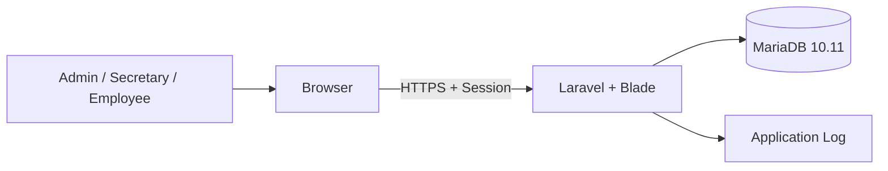
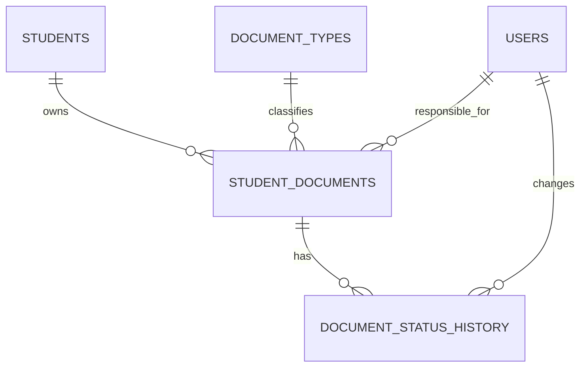

# ARCHITECHTURE

## 1. Phạm vi tài liệu

Tài liệu này định nghĩa kiến trúc kỹ thuật cho `docs/REQUIREMENT.md`. Database
`doctrack` trên MariaDB 10.11 là data model authoritative. Không thay schema để
phù hợp code nếu chưa có task schema change được phê duyệt.

## 2. Quyết định kiến trúc

| Hạng mục | Quyết định |
| --- | --- |
| Ứng dụng | Laravel 13 monolith, PHP 8.3 |
| Frontend | Blade, Tailwind CSS 4, Vite 8 |
| Database | MariaDB 10.11; schema chính `doctrack` |
| Xác thực | Laravel session, username/password |
| Password hiện hữu | Bcrypt-compatible |
| Phân quyền | Role + Policy + query scope theo người phụ trách |
| Backend flow | Controller → Form Request → Service → Repository → Model |
| Audit | Custom Service/Repository trên `activity_log`; không thêm package |
| File attachment | Ngoài MVP; không có persistence schema |
| Email | Không triển khai |

Không tạo REST API chỉ để phục vụ Blade, không dùng microservice, SPA, queue
workflow hoặc external search service cho MVP.

## 3. Bối cảnh triển khai



Database dữ liệu thật, development và test là ba database tách biệt nhưng phải
có cùng schema đã phê duyệt. Dữ liệu thật không được sao chép vào repository,
fixture hoặc CI.

## 4. Luồng request và dependency

```text
HTTP Request
  → Route/Middleware
  → Form Request
  → Controller
  → Service
  → Repository
  → Model
  → MariaDB
```

### 4.1. Controller

- Điều phối HTTP, gọi Service và trả Blade response/redirect hoặc JSON đã duyệt.
- Không gọi Model, Query Builder hoặc Repository trực tiếp.
- Không chứa business rule, transition hoặc transaction.

### 4.2. Form Request

- Validate, authorize và normalize nhẹ input HTTP.
- Chỉ chuyển validated data/DTO vào Service.
- Không ghi dữ liệu, mở transaction hoặc điều phối workflow.

### 4.3. Service

- Sở hữu business rule, status transition và transaction boundary.
- Điều phối repository, history và audit.
- Không đọc HTTP Request hoặc trả HTTP Response.

Các Service chính:

- `AuthenticationService`
- `DashboardService`
- `StudentDocumentService`
- `DocumentTypeService`
- `UserService`
- `ReportService`
- `ActivityLogService`

### 4.4. Repository

- Là persistence boundary duy nhất cho Eloquent/Query Builder.
- Sở hữu query search/filter/pagination/aggregate và row lock.
- Không authorize, quyết định transition hoặc mở business transaction.
- Contract đặt trong `App\Repositories\Contracts`; implementation đặt trong
  `App\Repositories\Eloquent`.
- Không tạo generic `BaseRepository`.

Repository chính:

- `UserRepository`
- `StudentRepository`
- `StudentDocumentRepository`
- `DocumentTypeRepository`
- `DocumentStatusRepository`
- `DocumentStatusHistoryRepository`
- `ReportRepository`
- `ActivityLogRepository`

### 4.5. Model và Blade

Model chỉ khai báo table mapping, relationship, cast, hidden/fillable và scope
đơn giản. Blade chỉ trình bày view data; không quyết định quyền hoặc nghiệp vụ.
Không truyền password hash, session payload hoặc raw sensitive Model fields tới
view/JSON.

## 5. Data model authoritative

### 5.1. Domain tables

| Table | Model | Vai trò |
| --- | --- | --- |
| `users` | `User` | Tài khoản, role, active state |
| `students` | `Student` | Dữ liệu sinh viên tham chiếu |
| `document_types` | `DocumentType` | Loại hồ sơ |
| `document_statuses` | `DocumentStatus` | Danh mục hiển thị trạng thái |
| `student_documents` | `StudentDocument` | Aggregate hồ sơ chính |
| `document_status_history` | `DocumentStatusHistory` | Lịch sử trạng thái append-only |
| `activity_log` | `ActivityLog` | Audit append-only |

### 5.2. Framework tables

- `sessions`
- `cache`, `cache_locks`
- `jobs`, `job_batches`, `failed_jobs`
- `password_reset_tokens` (không dùng cho email flow trong MVP)
- `migrations`

Không tạo table attachment, generic `records`, `record_assignments`,
`record_histories` hoặc `audit_logs` trong MVP.

### 5.3. Quan hệ



- `student_documents.student_code → students.student_code`.
- `student_documents.document_type_id → document_types.id`.
- `student_documents.assigned_secretary_user_id → users.id`.
- `document_status_history.student_document_id → student_documents.id`.
- `document_status_history.changed_by_user_id → users.id`.

`assigned_secretary_user_id` là legacy column name. Ứng dụng coi đây là người
phụ trách hiện tại và cho phép cả ba role đã duyệt; không tạo assignment table.

### 5.4. User mapping

`User` map đúng các column hiện hữu:

- `username`
- `password_hash`
- `full_name`
- `email` nullable nhưng không dùng cho email functionality
- `role`
- `is_active`
- `last_login_at`
- timestamps

Domain role mapping:

| Domain | Persistence |
| --- | --- |
| `ADMIN` | `admin` |
| `SECRETARY` | `secretary` |
| `EMPLOYEE` | `staff` |

Không đổi enum database hoặc thêm role trong MVP. Password authentication phải
đọc `password_hash` và hỗ trợ bcrypt hiện có. Reset password là thao tác nội bộ,
không dùng `password_reset_tokens` hoặc email.

### 5.5. Student document mapping

`StudentDocument` dùng đúng các column:

- `document_code`
- `student_code`
- `document_type_id`
- `status`
- `assigned_secretary_user_id`
- `submitted_at`
- `completed_at`
- `invalid_reason`
- `note`
- `updated_at`

Table không có `name`, `description`, `created_by` hoặc `created_at`; code không
được giả lập hoặc persist các field này. Trigger database giữ
`document_code` immutable.

## 6. Status workflow

PHP backed enum dùng đúng bảy code trong `document_statuses`:

- `waiting_for_receipt`
- `received`
- `processing`
- `needs_supplement`
- `completed`
- `invalid`
- `cancelled`

Transition map duy nhất tại domain/Service:

```text
waiting_for_receipt → received | cancelled
received            → processing | invalid | cancelled
processing          → needs_supplement | completed | invalid | cancelled
needs_supplement    → processing | cancelled
completed           → terminal
invalid             → terminal
cancelled           → terminal
```

Transition thực hiện trong một Service transaction:

1. Policy authorization.
2. Lock `student_documents` row.
3. Validate current/next state.
4. Enforce `completed_at` và `invalid_reason` invariant.
5. Update document.
6. Append `document_status_history`.
7. Append `activity_log`.

Không lấy `document_statuses` làm nguồn cho phép tạo status/workflow động. Table
này chỉ cung cấp label, badge, color, order và active/system metadata cho bảy
code đã duyệt.

## 7. Authorization

Authorization có ba lớp:

1. Middleware: authenticated + active account + route role.
2. Policy: action trên resource cụ thể.
3. Repository query scope: giới hạn list, dashboard và report.

| Action | Admin | Secretary | Employee |
| --- | --- | --- | --- |
| Xem dashboard | Toàn hệ thống | Toàn hệ thống | Hồ sơ được giao |
| Xem hồ sơ | Tất cả | Tất cả | `assigned_secretary_user_id = user.id` |
| Tạo hồ sơ | Có | Có | Không |
| Cập nhật hồ sơ | Có | Có | Hồ sơ được giao, theo Policy |
| Phân công | Có | Có | Không |
| Tiếp nhận hồ sơ được giao | Có | Có | Có |
| Đổi trạng thái | Có | Có | Chỉ hành động tiếp nhận được duyệt |
| Quản lý loại hồ sơ | Có | Không | Không |
| Quản lý người dùng | Có | Không | Không |
| Xem báo cáo | Có | Có | Không |
| Xem audit | Có | Không | Không |

Ẩn menu/button chỉ phục vụ UX, không thay thế backend authorization.

## 8. Authentication và session

- Login bằng username/password, chỉ cho `is_active = 1`.
- Verify bcrypt hash từ `password_hash` qua Laravel Hash contract.
- Regenerate session sau login; invalidate session và regenerate CSRF token sau
  logout.
- Middleware kiểm tra active account trên mọi route nội bộ.
- Rate-limit login; không log password hoặc credential.
- Session dùng database table hiện hữu khi configured.
- Không có email verification hoặc password reset qua email.

## 9. Search, filter và report

`StudentDocumentRepository` nhận criteria DTO với allowlist:

- Mã hồ sơ.
- Mã/họ tên sinh viên.
- Loại hồ sơ.
- Trạng thái.
- Người phụ trách.
- Khoảng `submitted_at`.
- Sort, direction, page và per-page có giới hạn.

Access scope được áp dụng trước search, pagination và aggregate. Report và
Dashboard aggregate tại MariaDB; không load toàn bộ dữ liệu vào PHP để đếm.

## 10. Audit

`ActivityLogService` và `ActivityLogRepository` ghi trực tiếp table
`activity_log` hiện hữu; không cài `spatie/laravel-activitylog` trong MVP.

- Audit là append-only; không có update/delete route.
- `event` là action code ổn định.
- `subject_type/id` và `causer_type/id` định danh subject/actor.
- `properties` chứa JSON metadata đã allowlist/mask.
- Không ghi password, hash, cookie, session payload, token, secret hoặc dữ liệu
  sinh viên không cần thiết.
- Chỉ Admin được xem audit log.

## 11. Transaction và concurrency

Service mở transaction cho:

- Tạo/cập nhật hồ sơ + audit.
- Phân công/tiếp nhận + audit.
- Đổi trạng thái + history + audit.
- Tạo/cập nhật/khóa/reset user + audit.
- Tạo/cập nhật/bật-tắt loại hồ sơ + audit.

Status transition, tiếp nhận và phân công dùng row lock. Transaction phải ngắn;
không render view, ghi network hoặc chạy query báo cáo trong transaction.

## 12. HTTP, response và exception

Blade route nằm trong `routes/web.php` và dùng redirect, flash message,
validation error bag, CSRF và session.

Không tạo `routes/api.php` nếu chưa có JSON use case được duyệt. Endpoint
`/api/*` thực tế phải dùng response envelope và pagination metadata trong
Requirement.

Central exception rendering tại `bootstrap/app.php` phân biệt HTML/JSON:

- Validation: 422 cho JSON hoặc redirect error bag cho Blade.
- Unauthenticated: 401/redirect login.
- Unauthorized: 403.
- Not found: 404.
- Business rule: 400 hoặc status đã phê duyệt.
- System error: 500 và log request ID.

Production luôn `APP_DEBUG=false`; không trả stack trace, SQL error, server path
hoặc secret.

## 13. UI structure

```text
resources/views/
├── auth/
├── components/
├── layouts/
├── dashboard/
├── student-documents/
├── document-types/
├── users/
├── reports/
├── activity-log/
└── errors/
```

Blade component dùng chung cho layout, breadcrumb, flash/error, form field,
status badge, table và pagination. Danh sách có loading, empty và error state;
giao diện responsive, ưu tiên desktop.

## 14. Database environments và security

- `doctrack`: database dữ liệu thật/source import; không dùng cho automated
  tests hoặc thao tác phá hủy.
- `student_document_management_dev`: development clone từ sanitized schema, dữ
  liệu giả.
- `student_document_management_test`: test clone từ cùng sanitized schema, dữ
  liệu giả và có thể reset bởi test setup đã kiểm soát.

Ba database phải có cùng domain schema trước khi coding phase phụ thuộc database.
Application dùng account riêng có least privilege; không kết nối bằng root.
Root phải có credential an toàn. Time zone kết nối là UTC, strict SQL mode bật,
charset/collation là `utf8mb4` phù hợp MariaDB 10.11.

Private dump và dữ liệu thật phải ở ngoài repository. Sanitized schema-only
baseline không được chứa `INSERT`, credential hoặc dữ liệu cá nhân.

## 15. Testing

### Unit

- Role persistence mapping.
- Status transition map và invariant.
- Criteria/DTO và Service rule độc lập database.

### Feature

- Login/logout/active account.
- Role và record-scope authorization.
- User/type/document flows.
- Search/filter/pagination.
- Status/history/audit atomicity.
- Blade validation và centralized errors.

### MariaDB integration

- Schema, foreign key, unique/index và immutable-code trigger.
- Transaction rollback và row locking.
- Status/completed/invalid invariants ở Service và database đã phê duyệt.
- Search/collation, dashboard/report aggregates.

Không dùng SQLite cho migration, constraint, transaction hoặc locking test.

## 16. Ngoài phạm vi

- Attachment và file storage nghiệp vụ.
- CRUD sinh viên.
- Email.
- XLSX/PDF.
- Dynamic role/status/permission model.
- SPA/API-first/mobile app.
- Dependency audit package.
- Microservice, external integration và workflow engine.

## 17. Điều kiện trước Phase 1

P0-02 phải hoàn tất:

- Tạo sanitized schema-only baseline từ `doctrack` và kiểm chứng trên MariaDB
  10.11.
- Đồng bộ development/test schema với baseline mà không dùng dữ liệu thật.
- Cấu hình application account riêng; không dùng root.
- Xử lý hoặc phê duyệt remediation cho các dữ liệu vi phạm status/invariant đã
  phát hiện trong database thật.
- Privacy guard và schema validation phải chạy được.
