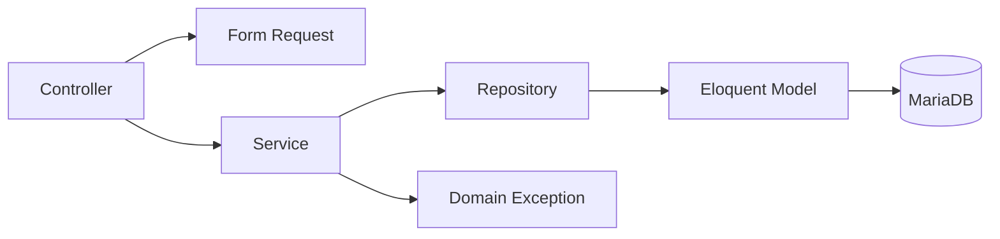
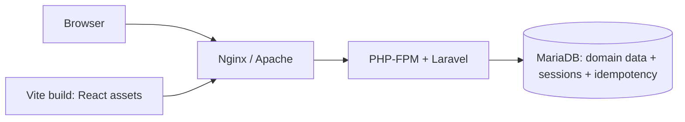

# ARCHITECTURE — Hệ thống quản lý tiếp nhận hồ sơ sinh viên

> Trạng thái: Approved for Conditional Implementation — P0–P8; production gates pending
> Ngày cập nhật: 2026-07-30
> Nguồn yêu cầu: `REQUIREMENTS.md`
> Baseline hiện tại: `student_document_management.sql` (private local input, không commit; CI dùng sanitized schema-only baseline)

## 1. Mục tiêu và phạm vi

Kiến trúc dành cho website quản lý tiếp nhận hồ sơ sinh viên của khoa CNTT, với các nguyên tắc:

- Dùng Laravel, React + TypeScript, Inertia.js, Blade và MariaDB dưới dạng modular monolith.
- Controller sử dụng Form Request để authorize/validate input; dependency chain bắt buộc là **Controller → Service → Repository → Model**.
- Controller mỏng; business rule và transaction tập trung tại Service.
- Việc đổi trạng thái và ghi lịch sử phải là một thao tác nguyên tử.
- Chuẩn hóa tên, lỗi và response để mọi module dùng chung một quy ước.

Trong phạm vi: nộp/tra cứu hồ sơ công khai, đăng nhập nội bộ, phân quyền Staff–Thư ký–Admin, xử lý hồ sơ, quản lý danh mục/sinh viên/tài khoản và báo cáo.

Ngoài phạm vi: quản lý lớp/khoa, tự động xác định sinh viên còn học, tự động phát hiện hồ sơ trùng, mobile app và API công khai cho bên thứ ba.

Khi sinh viên nộp hồ sơ, hệ thống chỉ kiểm tra `student_code` tồn tại. Thư ký xác minh thủ công tình trạng học khi xử lý; nếu sinh viên không còn học, hồ sơ được chuyển sang `invalid` và bắt buộc có `invalid_reason`.

## 2. Quyết định kiến trúc

| ID | Quyết định | Trạng thái |
|---|---|---|
| ADR-001 | Modular monolith | Đã chốt |
| ADR-002 | Laravel 13.x, hỗ trợ PHP 8.3–8.5; development và CI cố định PHP 8.4 | Đã chốt |
| ADR-003 | React + TypeScript qua Inertia.js là UI chính cho khu vực nội bộ; Blade dùng cho trang công khai, trang lỗi và HTML shell | Đã chốt |
| ADR-004 | Eloquent ORM; Query Builder cho báo cáo phức tạp | Đã chốt |
| ADR-005 | Session authentication trên bảng `users` hiện có | Đã chốt |
| ADR-006 | Controller sử dụng Form Request; dependency chain `Controller → Service → Repository → Model` | Bắt buộc |
| ADR-007 | Service sở hữu transaction nghiệp vụ | Bắt buộc |
| ADR-008 | Lưu UTC, hiển thị `Asia/Ho_Chi_Minh` | Đã chốt |
| ADR-009 | MariaDB 10.11 cho development, test/CI và production target; baseline MariaDB 10.4 chỉ là nguồn import | Đã chốt — 2026-07-30 |
| ADR-010 | Một application instance cho MVP; thiết kế không được ngăn cản nâng cấp nhiều instance sau này | Đã chốt — 2026-07-30 |
| ADR-011 | React nằm cùng Laravel application, dùng session/CSRF và web routes; không tách SPA/API repository trong MVP | Đã chốt |
| ADR-012 | Session dùng `SESSION_DRIVER=database`, `SESSION_EXPIRE_ON_CLOSE=true`, `SESSION_LIFETIME=120`, không remember-me/Redis; Public Submission idempotency dùng bảng MariaDB riêng, transaction và unique constraint | Đã chốt — 2026-07-30 |

## 3. Kiến trúc tổng thể

### 3.1 Dependency architecture



Quy tắc phụ thuộc:

- Controller không gọi Model hoặc `DB` trực tiếp.
- Form Request không mở transaction, ghi dữ liệu hoặc điều phối workflow.
- Service không đọc request và không trả `View`, `RedirectResponse` hay `JsonResponse`.
- Repository là tầng bắt buộc cho mọi truy cập persistence của application theo yêu cầu phân tầng của khoa; Service không gọi Eloquent/Query Builder trực tiếp.
- Repository không quyết định quyền hoặc transition nghiệp vụ.
- Model/Repository không phụ thuộc HTTP.
- Không tạo `BaseRepository` CRUD tổng quát; interface và method phải bám theo nhu cầu của từng use case/aggregate.

### 3.2 Runtime request lifecycle

```text
HTTP → Route/Middleware → Form Request → Controller → Service
     → Repository → Eloquent Model → MariaDB
                                  ↘ Inertia response → React page
                                  ↘ Blade response   → Public/error page
```

## 4. Cấu trúc thư mục

```text
app/
├── Enums/                         # DocumentStatus, UserRole
├── Exceptions/                    # BusinessRule, Concurrency, NotFound
├── Http/
│   ├── Controllers/
│   │   ├── Public/
│   │   ├── Internal/              # Shared reception endpoint
│   │   ├── Staff/
│   │   ├── Secretary/
│   │   └── Admin/
│   ├── Middleware/
│   ├── Requests/
│   │   ├── Auth/
│   │   ├── Student/
│   │   ├── Document/
│   │   └── Admin/
│   └── Resources/                 # Chỉ cho JSON
├── Models/
├── Policies/
├── Providers/AppServiceProvider.php
├── Repositories/
│   ├── Contracts/
│   └── Eloquent/
├── Services/
│   ├── Auth/
│   ├── Student/
│   ├── Document/
│   ├── Admin/
│   └── Report/
└── Support/                       # ApiResponse, RequestTrace, Clock

bootstrap/app.php                  # Exception rendering tập trung
database/{migrations,seeders}/
resources/js/
├── components/                    # UI dùng lại, không chứa business rule
├── layouts/                       # Authenticated/Public layouts
├── pages/{auth,staff,secretary,admin}/
├── types/                         # Page props và DTO TypeScript
├── lib/                           # Formatter/helper thuần
└── app.tsx                        # Inertia entry point
resources/views/{public,components,errors,app.blade.php}/
routes/{web.php,api.php}
tests/{Feature,Integration,Unit}/
tests/frontend/                    # Component/UI tests
```

`routes/api.php` và `Http/Resources` chỉ dùng khi có endpoint JSON cụ thể. Inertia và form Blade đều đi qua `routes/web.php`, dùng session authentication, CSRF và authorization phía máy chủ.

### 4.1 Phân chia giao diện

- React + TypeScript qua Inertia đảm nhiệm đăng nhập và toàn bộ màn hình nội bộ Staff, Thư ký, Admin: danh sách, bộ lọc, chi tiết, lịch sử, chuyển trạng thái, quản trị và báo cáo.
- Blade đảm nhiệm Public Submission/Public Lookup, các trang lỗi và `app.blade.php` làm HTML shell cho Inertia.
- Controller nội bộ trả `Inertia::render()` với page props tối thiểu; không tạo endpoint JSON chỉ để cấp dữ liệu cho một Inertia page.
- Mutation từ React gửi qua Inertia form tới web route hiện có. Form Request, Policy, Service và transaction phía máy chủ vẫn là nguồn kiểm soát; trạng thái nút ở client không phải authorization.
- Props chỉ chứa dữ liệu cần cho màn hình và dùng DTO/API Resource có chủ đích; không serialize nguyên Model hoặc relationship ngoài phạm vi.
- Filter/sort/page nằm trong URL để tải lại, chia sẻ và back/forward đúng. Các request độc lập được tải song song; dữ liệu nặng dùng deferred props khi có số đo chứng minh cần thiết.
- Component không định nghĩa lồng trong component khác; business state được dẫn xuất trong render thay vì đồng bộ bằng effect. Thư viện nặng chỉ tải động tại màn hình sử dụng.
- TypeScript bật strict mode. Tên page/component dùng `PascalCase`, hook dùng `use...`, module helper dùng `camelCase`.

File import dữ liệu Sinh viên thật phải nằm ngoài Git và ngoài automated test/CI. Đường dẫn private import được truyền qua environment/config tại runtime quản trị; repository chỉ chứa schema migration, sanitized metadata baseline và dữ liệu giả phục vụ test.

## 5. Trách nhiệm các tầng

### 5.1 Controller

Controller chỉ nhận Form Request đã validate, gọi một use case chính và chuyển kết quả thành Inertia response, Blade view, redirect hoặc JSON. Controller không chứa business rule, query, transaction hoặc `try/catch` lặp lại.

```php
final class StudentDocumentController extends Controller
{
    public function store(
        StoreStudentDocumentRequest $request,
        StudentDocumentService $service,
    ): RedirectResponse {
        $document = $service->createDocument($request->validated());

        return redirect()
            ->route('documents.submission-result', [
                'documentCode' => $document->document_code,
            ])
            ->with('success', 'Hồ sơ đã được gửi thành công.');
    }
}
```

### 5.2 Form Request

Form Request chịu trách nhiệm:

- `authorize()` qua user/policy.
- Kiểm tra kiểu, định dạng, required/nullable, độ dài và tham chiếu đơn giản.
- Chuẩn hóa input nhẹ trong `prepareForValidation()`, ví dụ trim `student_code`.
- Cung cấp message/attribute tiếng Việt thống nhất.

Form Request không quyết định state transition, không khóa bản ghi, không ghi database.

Các request chính: `LoginRequest`, `VerifyStudentRequest`, `StoreStudentDocumentRequest`, `ReceiveStudentDocumentRequest`, `TransitionStudentDocumentStatusRequest`, `StoreUserRequest`, `UpdateUserRequest`, `StoreDocumentTypeRequest`, `UpdateDocumentTypeRequest`.

```php
'invalid_reason' => [
    Rule::requiredIf(
        fn () => $this->input('status') === DocumentStatus::Invalid->value
    ),
    Rule::prohibitedIf(
        fn () => $this->input('status') !== DocumentStatus::Invalid->value
    ),
    'nullable',
    'string',
    'max:200',
],
'note' => ['nullable', 'string', 'max:500'],
```

Khi trạng thái khác `invalid`, Form Request cấm client gửi `invalid_reason`. Input ghi chú rỗng sau khi trim được chuẩn hóa thành `NULL`. Service phải kiểm tra lại invariant quan trọng vì nó có thể được gọi ngoài HTTP. Constraint database là lớp bảo vệ cuối cùng.

### 5.3 Service

Service hiện thực use case, áp dụng business rule/state machine, điều phối Repository, sở hữu `DB::transaction()` và ném exception có nghĩa nghiệp vụ. Service trả Model, DTO hoặc dữ liệu thuần PHP.

Service dự kiến: `StudentVerificationService`, `StudentDocumentService`, `DocumentWorkflowService`, `UserAdministrationService`, `DocumentTypeService`, `ReportService`. Không tạo `CommonService`.

### 5.4 Repository

Repository là boundary bắt buộc giữa Service và dữ liệu, không chỉ dành cho query phức tạp. Repository đóng gói Eloquent/Query Builder, eager loading, filter, phân trang, khóa bản ghi và persistence. Repository không mở transaction nghiệp vụ, không kiểm tra quyền, không quyết định transition, không trả HTTP response và không nuốt exception database.

```php
interface StudentDocumentRepositoryInterface
{
    public function findForUpdate(int $id): StudentDocument;
    public function create(array $attributes): StudentDocument;
    public function updateCurrentState(
        StudentDocument $document,
        DocumentStatus $status,
        ?string $invalidReason,
        ?string $note,
        ?int $assignedSecretaryUserId,
        ?CarbonImmutable $completedAt,
    ): void;
}
```

Interface đặt trong `Repositories\Contracts`, implementation trong `Repositories\Eloquent`. Binding khai báo tại `AppServiceProvider`:

```php
$this->app->bind(
    StudentDocumentRepositoryInterface::class,
    EloquentStudentDocumentRepository::class,
);
```

### 5.5 Model

Model khai báo table, primary key, fillable/guarded, casts, timestamp mapping, relationship và scope nhỏ. Model không điều phối workflow nhiều bảng.

| Model | Bảng | Lưu ý |
|---|---|---|
| `Student` | `students` | PK `student_code`, string, không auto-increment |
| `DocumentType` | `document_types` | Danh mục loại hồ sơ |
| `StudentDocument` | `student_documents` | Trạng thái hiện tại và `invalid_reason` |
| `DocumentStatusHistory` | `document_status_history` | Một dòng cho mỗi lần đổi trạng thái |
| `User` | `users` | Kế thừa `Authenticatable`; ánh xạ `password_hash` |

Vì schema dùng `password_hash`, `User` phải override:

```php
public function getAuthPasswordName(): string
{
    return 'password_hash';
}
```

Các cột thời gian không theo convention `created_at`/`updated_at` phải được khai báo rõ; không đổi schema ngầm chỉ để khớp Eloquent.

## 6. Module nghiệp vụ

| Module | Trách nhiệm chính | Trạng thái triển khai |
|---|---|---|
| Student Directory | Kiểm tra `student_code`, quản trị/import danh sách sinh viên | Ready for planning |
| Document Catalog | Quản lý loại hồ sơ | Ready for planning |
| Public Submission | Sinh viên nộp hồ sơ bằng `student_code`, loại hồ sơ và idempotency token | Ready for planning |
| Public Lookup | Tra cứu toàn bộ danh sách hồ sơ chỉ bằng `student_code` | Ready for planning |
| Document Reception | Staff hoặc Thư ký xác nhận tiếp nhận qua shared use case | Ready for planning |
| Document Processing | Thư ký kiểm tra thủ công và chuyển trạng thái | Ready for planning |
| Identity & Access | Đăng nhập, đăng xuất, session và phân quyền | Ready for planning |
| Administration | Quản lý tài khoản và cấu hình được cho phép | Ready for planning |
| Reporting | Tổng hợp số liệu hồ sơ | Ready for planning; NFR pending |

Các module dùng chung Model khi cùng một database, nhưng tách Controller, Form Request và Service theo use case. Chỉ tách package/domain độc lập khi quy mô thực tế đòi hỏi.

DG-001 đã được chốt: `student_code` là input duy nhất của Public Lookup. Không yêu cầu `document_code`, đăng nhập, OTP, CAPTCHA hoặc yếu tố xác minh thứ hai. Kết quả trả toàn bộ danh sách hồ sơ thuộc mã sinh viên với đúng các trường FR-002/FR-009; không có route/page public xem chi tiết riêng một hồ sơ hoặc xem lịch sử. DG-006 cũng đã được chốt theo cơ chế idempotency tại mục 6.2; P8 đủ điều kiện planning theo dependency.

### 6.1 Sinh mã hồ sơ

`DocumentCodeGenerator` là dependency thuần của `StudentDocumentService`. Generator chỉ nhận thời điểm/nguồn ngẫu nhiên và trả về một candidate code theo BR-010; không gọi Repository, không insert, không bắt `QueryException` và không retry collision.

Quy tắc bắt buộc:

- Alphabet chính xác: `ABCDEFGHJKLMNPQRSTUVWXYZ23456789`.
- Phần ngày lấy theo `Asia/Ho_Chi_Minh`, không lấy trực tiếp từ ngày UTC.
- Tám ký tự ngẫu nhiên dùng `random_int()` hoặc nguồn ngẫu nhiên an toàn tương đương.
- `StudentDocumentService` không query pre-check vì không loại bỏ được race condition; Service lấy candidate từ generator và thử insert trực tiếp.
- Unique constraint `uq_student_documents_document_code` quyết định collision.
- Chỉ `StudentDocumentService` bắt `QueryException` xác định đúng constraint trên để yêu cầu candidate mới và retry, tối đa 5 lần.
- Service phải ném lại mọi lỗi database khác; hết 5 collision thì ném `DocumentCodeGenerationException`.
- Repository không cung cấp method sửa `document_code`; unique constraint và trigger database là lớp bảo vệ cuối cho tính duy nhất/bất biến.

### 6.2 Idempotency của Public Submission

- GET form tạo token ngẫu nhiên an toàn, gắn với session, TTL 10 phút, rồi lưu một bản ghi trong `public_submission_idempotency`.
- Bảng `public_submission_idempotency` dùng schema tối thiểu sau; `payload_hash` và `student_document_id` để `NULL` cho đến lần POST hợp lệ đầu tiên:

| Cột | Kiểu/constraint |
|---|---|
| `id` | `BIGINT UNSIGNED`, primary key |
| `token` | `CHAR(64)`, `NOT NULL`, unique |
| `session_id` | `VARCHAR(255)`, `NOT NULL` |
| `payload_hash` | `CHAR(64)`, nullable |
| `student_document_id` | `BIGINT UNSIGNED`, nullable, foreign key đến `student_documents.id` |
| `expires_at` | `DATETIME`, `NOT NULL`, indexed |

- Token là 32 byte ngẫu nhiên an toàn được mã hóa hex; `payload_hash` là SHA-256 của payload nghiệp vụ đã canonicalize. Không đưa CSRF token hoặc idempotency token vào payload hash.
- POST mở transaction, khóa bản ghi token bằng `SELECT ... FOR UPDATE`/`lockForUpdate()`, kiểm tra session và hạn dùng, rồi tính/đối chiếu payload hash. Lần gửi hợp lệ đầu tiên tạo hồ sơ và cập nhật tham chiếu hồ sơ trên bản ghi idempotency trong cùng transaction.
- Retry cùng token và payload trả lại cùng hồ sơ đã ánh xạ; không gọi lại create use case và không insert hồ sơ mới.
- Cùng token nhưng payload khác, token hết hạn hoặc token không tồn tại bị từ chối bằng lỗi validation/business rule; không tạo hồ sơ.
- Transaction, row lock và unique constraint phải bảo đảm hai request đồng thời không cùng vượt qua lần xử lý đầu tiên. Không dùng memory, file cache hoặc dữ liệu session làm nguồn duy nhất của idempotency.
- Tải form mới tạo token mới. Token mới không bị coi là hồ sơ trùng kỹ thuật; business rule BR-003 vẫn cho phép chủ động tạo hồ sơ cùng loại.
- Token không thay thế CSRF token. CSRF bảo vệ request, idempotency bảo vệ retry/double-submit.

## 7. Workflow trạng thái

`DocumentStatus` là nguồn tên trạng thái tại application:

```php
enum DocumentStatus: string
{
    case WaitingForReceipt = 'waiting_for_receipt';
    case Received = 'received';
    case Processing = 'processing';
    case NeedsSupplement = 'needs_supplement';
    case Completed = 'completed';
    case Invalid = 'invalid';
    case Cancelled = 'cancelled';
}
```

Service kiểm soát transition theo `REQUIREMENTS.md`; database kiểm soát tập giá trị và invariant dữ liệu.

- Khi trạng thái mới là `invalid`, `invalid_reason` là văn bản tự do bắt buộc, trim xong phải còn nội dung, tối đa 200 ký tự.
- Khi trạng thái mới khác `invalid`, `invalid_reason` phải là `NULL`.
- Service trim lý do khi chuyển sang `invalid` và ném `BusinessRuleException` nếu lý do rỗng/quá 200 ký tự; Service cũng ném lỗi nếu nhận `invalid_reason` cho trạng thái khác thay vì âm thầm lưu sai invariant.
- `student_documents.note` là ghi chú của trạng thái hiện tại, tối đa 500 ký tự. Nếu lần chuyển mới không có ghi chú thì giá trị hiện tại được đặt về `NULL`.
- `document_status_history.note` là snapshot bất biến của ghi chú trong đúng lần chuyển trạng thái đó, tối đa 500 ký tự.
- `note` độc lập và không thay thế `invalid_reason`.
- Không giới hạn ba lý do cố định và không có quy tắc riêng cho `duplicate`.
- Lịch sử chỉ lưu trạng thái mới, không lưu trạng thái cũ.
- `completed_at` được đặt bằng thời điểm UTC khi chuyển sang `completed`; mọi trạng thái khác bắt buộc để `NULL`.
- `assigned_secretary_user_id` là Thư ký chịu trách nhiệm chính, không phải người xử lý gần nhất và không tạo authorization độc quyền. Mọi Thư ký đang hoạt động có thể thực hiện transition hợp lệ trên mọi hồ sơ. Staff không cập nhật cột này; cột được gán khi Thư ký bắt đầu xử lý và Thư ký khác không tự ghi đè assignment khi thao tác.
- `resolveAssignment()` chỉ gán actor khi actor là Thư ký, hồ sơ chưa được phân công, trạng thái hiện tại là `received` và trạng thái mới là `processing`; mọi trường hợp khác giữ nguyên giá trị phân công hiện tại.
- Admin không được khóa hoặc đổi role một Thư ký còn phụ trách hồ sơ chưa kết thúc. Use case quản trị phải khóa các hồ sơ mở liên quan, tái phân công toàn bộ sang một Thư ký đang hoạt động khác và khóa/đổi role trong cùng transaction; nếu không có người thay thế hợp lệ thì từ chối thao tác.
- Người thực hiện từng lần chuyển luôn được lưu tại `document_status_history.changed_by_user_id`.
- Public Submission chỉ tạo `student_documents` ở `waiting_for_receipt`, không tạo `document_status_history`. History đầu tiên chỉ được tạo khi Staff hoặc Thư ký thực hiện transition `waiting_for_receipt → received`.

### 7.1 State transition matrix

Side effect chung của mọi transition thành công:

- Khóa hồ sơ bằng `lockForUpdate()`, cập nhật `status` và `updated_at` trong cùng transaction.
- `student_documents.note` nhận note của transition hiện tại hoặc `NULL`; note tối đa 500 ký tự. Staff không nhập note, Thư ký được nhập tùy chọn.
- `invalid_reason` tuân invariant hai chiều; chỉ transition sang `invalid` được nhận lý do và lý do là bắt buộc.
- `completed_at` nhận cùng biến `$now` khi next status là `completed`; trường hợp khác là `NULL`.
- Giữ nguyên `assigned_secretary_user_id`, trừ side effect gán được nêu riêng trong matrix.
- Tạo đúng một `document_status_history` bất biến với next status, reason, note, actor và cùng biến `$now`.

| Current status | Next status | Allowed role | Requirement IDs | Side effects riêng |
|---|---|---|---|---|
| `waiting_for_receipt` | `received` | Staff, Thư ký | FR-015, FR-017, FR-022, BR-005, BR-006 | Tạo history đầu tiên; không thay đổi phân công; Staff đặt current note/history note là `NULL` |
| `waiting_for_receipt` | `cancelled` | Thư ký | FR-021, FR-022, BR-005, BR-006 | `invalid_reason = NULL`, `completed_at = NULL` |
| `received` | `processing` | Thư ký | FR-018, FR-022, BR-005, BR-006 | Nếu chưa phân công thì gán actor vào `assigned_secretary_user_id`; không ghi đè phân công đã có |
| `received` | `cancelled` | Thư ký | FR-021, FR-022, BR-005, BR-006 | Giữ nguyên phân công nếu có; `invalid_reason = NULL`, `completed_at = NULL` |
| `processing` | `needs_supplement` | Thư ký | FR-018, FR-022, BR-005, BR-006 | Giữ nguyên phân công; `invalid_reason = NULL`, `completed_at = NULL` |
| `processing` | `completed` | Thư ký | FR-018, FR-020, FR-022, BR-005, BR-006, BR-008 | Đặt `completed_at = $now`; `invalid_reason = NULL` |
| `processing` | `invalid` | Thư ký | FR-018, FR-022, BR-005, BR-006, BR-009 | Bắt buộc `invalid_reason` sau trim dài 1–200 ký tự; `completed_at = NULL` |
| `processing` | `cancelled` | Thư ký | FR-021, FR-022, BR-005, BR-006 | Giữ nguyên phân công; `invalid_reason = NULL`, `completed_at = NULL` |
| `needs_supplement` | `processing` | Thư ký | FR-018, FR-022, BR-005, BR-006 | Giữ nguyên phân công, không tự gán lại/ghi đè |
| `needs_supplement` | `cancelled` | Thư ký | FR-021, FR-022, BR-005, BR-006 | Giữ nguyên phân công; `invalid_reason = NULL`, `completed_at = NULL` |
| `completed` | Không có | Không role nào | BR-005 | Terminal; mọi transition bị từ chối, không ghi history |
| `invalid` | Không có | Không role nào | BR-005 | Terminal; mọi transition bị từ chối, không ghi history |
| `cancelled` | Không có | Không role nào | BR-005 | Terminal; mọi transition bị từ chối, không ghi history |

Mọi cặp current/next không có trong matrix đều bị từ chối. Staff chỉ có duy nhất transition `waiting_for_receipt → received`.

Reception dùng chung `Internal\DocumentReceptionController`, `ReceiveStudentDocumentRequest` và một receive use case. Route dùng chung `/internal/documents/{document}/receive` được Policy cho phép cả Staff và Thư ký gọi; không đặt receive controller chỉ trong namespace/route group Staff. React/Inertia UI của cả hai role submit tới cùng endpoint này.

## 8. Transaction và đồng thời

Mọi chuyển trạng thái chạy trong một transaction do Service sở hữu:

```php
final class DocumentWorkflowService
{
    public function __construct(
        private StudentDocumentRepositoryInterface $documents,
        private DocumentStatusHistoryRepositoryInterface $history,
        private Clock $clock,
    ) {}

    public function transitionStatus(
        int $documentId,
        DocumentStatus $newStatus,
        ?string $invalidReason,
        ?string $note,
        User $actor,
    ): StudentDocument {
        return DB::transaction(function () use (
            $documentId, $newStatus, $invalidReason, $note, $actor
        ) {
            $document = $this->documents->findForUpdate($documentId);
            $now = $this->clock->nowUtc();

            $this->assertTransitionAllowed($document, $newStatus);
            $invalidReason = $this->normalizeInvalidReason(
                $newStatus,
                $invalidReason,
            );
            $note = $this->normalizeNote($note);
            $assignedSecretaryUserId = $this->resolveAssignment(
                $document,
                $newStatus,
                $actor,
            );
            $completedAt = $newStatus === DocumentStatus::Completed
                ? $now
                : null;

            $this->documents->updateCurrentState(
                $document,
                $newStatus,
                $invalidReason,
                $note,
                $assignedSecretaryUserId,
                $completedAt,
            );

            $this->history->create([
                'student_document_id' => $document->getKey(),
                'status' => $newStatus->value,
                'invalid_reason' => $invalidReason,
                'note' => $note,
                'changed_by_user_id' => $actor->getKey(),
                'changed_at' => $now,
            ]);

            return $document->refresh();
        });
    }
}
```

Yêu cầu:

- `findForUpdate()` dùng `lockForUpdate()` và chỉ gọi bên trong transaction.
- Update `student_documents` và insert `document_status_history` phải cùng transaction.
- Update phải đồng bộ `status`, `invalid_reason`, ghi chú trạng thái hiện tại, phân công Thư ký và `completed_at` theo invariant đã chốt.
- Dòng lịch sử đã tạo là bất biến; không update `status`, `invalid_reason`, `note`, người thực hiện hoặc thời gian của lịch sử cũ.
- Bất kỳ bước nào lỗi thì toàn bộ transaction rollback.
- Không dùng read-then-write ngoài transaction cho đổi trạng thái.
- Deadlock/lock timeout chỉ retry giới hạn nếu thao tác idempotent; không retry vô hạn.
- Chưa thêm optimistic locking khi chưa có nhu cầu nhiều client.

## 9. Authentication và authorization

### 9.1 Authentication

- Dùng session guard của Laravel cho giao diện nội bộ.
- Cấu hình session là `SESSION_DRIVER=database`, `SESSION_EXPIRE_ON_CLOSE=true`, `SESSION_LIFETIME=120`; phiên hết khi đóng trình duyệt hoặc sau 120 phút không hoạt động, tùy điều kiện nào đến trước. MVP không dùng Redis và không triển khai remember-me.
- `User` kế thừa `Illuminate\Foundation\Auth\User`.
- Mật khẩu có tối thiểu 8 ký tự, dùng Argon2id qua Laravel `Hash`; không tự so sánh hash.
- Không yêu cầu composition rule bắt buộc. Khi cơ chế kiểm tra khả dụng, validation phải từ chối mật khẩu phổ biến hoặc đã bị lộ.
- Chỉ `is_active = true` được đăng nhập.
- Đăng nhập sai không hard-lock tài khoản và không được tự thay đổi `users.is_active`.
- Mọi trường hợp đăng nhập thất bại dùng cùng một thông báo lỗi chung, không phân biệt username không tồn tại, mật khẩu sai hoặc tài khoản inactive.
- Đăng nhập thành công phải regenerate session ID.
- Đăng xuất phải invalidate session và regenerate CSRF token.
- Admin reset mật khẩu thành mật khẩu tạm; người dùng không bắt buộc đổi mật khẩu ở lần đăng nhập tiếp theo.
- Admin đầu tiên được tạo bằng Artisan command tương tác. Command không có credential mặc định, không nhận mật khẩu qua argument và không ghi mật khẩu vào log.
- Web routes dùng CSRF protection mặc định.

### 9.2 Authorization

1. Middleware `auth` bảo vệ khu vực nội bộ.
2. Role middleware/Gate giới hạn màn hình Staff, Secretary, Admin.
3. Policy kiểm tra thao tác trên từng hồ sơ.

Controller gọi `authorize()` hoặc Form Request thực hiện authorization. Việc ẩn nút ở giao diện không thay thế kiểm tra quyền phía server.

## 10. Chuẩn đặt tên

### 10.1 PHP/Laravel

| Thành phần | Quy ước | Ví dụ |
|---|---|---|
| Namespace/class/enum | PSR-4, `StudlyCase` | `DocumentWorkflowService` |
| Method/biến | `camelCase` | `transitionStatus()` |
| Enum case | `StudlyCase` | `NeedsSupplement` |
| Controller | Danh từ số ít + `Controller` | `StudentDocumentController` |
| Form Request | Use case + đối tượng + `Request` | `StoreStudentDocumentRequest` |
| Service | Nhóm nghiệp vụ + `Service` | `StudentDocumentService` |
| Repository interface | Entity + `RepositoryInterface` | `StudentDocumentRepositoryInterface` |
| Repository implementation | `Eloquent` + entity + `Repository` | `EloquentStudentDocumentRepository` |
| Policy | Entity + `Policy` | `StudentDocumentPolicy` |
| Exception | Ý nghĩa lỗi + `Exception` | `InvalidStatusTransitionException` |
| Test | Use case + `Test` | `TransitionDocumentStatusTest` |

Tên method phải thể hiện mục đích:

- Service: `createDocument`, `receiveDocument`, `transitionStatus`, `verifyStudentCode`.
- Repository: `findById`, `findForUpdate`, `paginateByFilters`, `create`, `updateCurrentState`.
- Tránh `handleData`, `process`, `doAction`, `saveAll`.

### 10.2 Database

- Table/column: `snake_case`; table dùng danh từ số nhiều.
- Foreign key column: `<entity>_id`, trừ khóa tự nhiên như `student_code`.
- Index: `idx_<table>_<column[_column]>`.
- Unique: `uq_<table>_<column[_column]>`.
- Foreign key: `fk_<child_table>_<foreign_key_column>`.
- Check: `chk_<table>_<rule>`.
- Không đổi tên cột chỉ để khớp Eloquent; Model phải mapping rõ.

### 10.3 Route và giao diện

- URI dùng `kebab-case`, danh từ số nhiều.
- Route name dùng dấu chấm: `documents.store`, `secretary.documents.transition`, `admin.users.index`.
- Inertia page dùng `PascalCase` theo domain: `Staff/Documents/Index`, `Admin/DocumentTypes/Index`.
- React component dùng `PascalCase.tsx`; hook dùng `useCamelCase.ts`; type dùng tên nghiệp vụ rõ nghĩa.
- Blade view theo thư mục và `snake_case`: `public.documents.lookup`, `errors.403`.

## 11. Xử lý lỗi tập trung

Exception được ánh xạ trong `bootstrap/app.php` bằng `withExceptions()`. Controller không lặp `try/catch` cho lỗi đã chuẩn hóa.

Inertia/Blade web:

| Lỗi | HTTP/behavior |
|---|---|
| Validation | `302`, redirect back với errors và old input |
| Chưa đăng nhập | `302`, redirect trang login |
| Không có quyền | Trang `403` |
| Không tìm thấy | Trang `404` |
| Vi phạm business rule | `302`, redirect back với lỗi nghiệp vụ |
| Xung đột cập nhật | Trang/thông báo `409`, yêu cầu tải lại dữ liệu |
| Quá giới hạn request | Trang/thông báo `429` |
| Lỗi không dự kiến | Trang lỗi `500` |

JSON:

| Lỗi | HTTP/behavior |
|---|---|
| Validation | `422`, `errors` theo field |
| Chưa đăng nhập | `401`, error envelope |
| Không có quyền | `403`, error envelope |
| Không tìm thấy | `404`, error envelope |
| Vi phạm business rule | `422`, error envelope |
| Xung đột cập nhật | `409`, error envelope |
| Quá giới hạn request | `429`, error envelope |
| Lỗi không dự kiến | `500`, không trả stack trace |

Exception nghiệp vụ gồm `BusinessRuleException`, `InvalidStatusTransitionException`, `ResourceNotFoundException`, `ConcurrencyException`.

Nguyên tắc:

- Không trả SQL message, stack trace, path máy chủ hoặc chi tiết nội bộ.
- Lỗi 500 có `trace_id` để đối chiếu log.
- Chỉ log một lần tại biên exception; kèm actor ID, route, document ID và trace ID khi phù hợp.
- Không log password/hash, cookie, CSRF token hoặc toàn bộ dữ liệu cá nhân.
- Không log toàn văn `invalid_reason` và `note` theo mặc định.

```php
->withExceptions(function (Exceptions $exceptions): void {
    $exceptions->render(function (
        BusinessRuleException $exception,
        Request $request,
    ) {
        if (! $request->expectsJson()) {
            return back()
                ->withInput()
                ->withErrors(['business' => $exception->getMessage()]);
        }

        return ApiResponse::error(
            message: $exception->getMessage(),
            status: 422,
        );
    });
})
```

## 12. Response chuẩn

### 12.1 Inertia/Blade web

Áp dụng Post/Redirect/Get:

- GET nội bộ thành công trả `Inertia::render(...)`; GET công khai/trang lỗi trả `view(...)`.
- POST/PATCH/DELETE thành công redirect tới route ổn định và flash `success`.
- Validation thất bại để Laravel redirect back với errors và old input.
- Business rule thất bại redirect back với key lỗi `business`.
- Inertia tự chuyển validation/flash thành page props theo middleware chia sẻ; không tự tạo JSON envelope cho Inertia.
- Form Blade thông thường không trả JSON.

Flash key thống nhất: `success`, `warning`, `error`.

### 12.2 JSON

JSON chỉ dùng cho AJAX/API nội bộ đã xác định. Mọi endpoint JSON dùng `ApiResponse` và Laravel API Resource; Controller không tự ghép response tùy ý.

Envelope thành công gồm: `success = true`, `message`, `data`, `meta` và `trace_id`.

Envelope thất bại gồm: `success = false`, `message`, `data = null`, `errors` theo field và `trace_id`.

| HTTP JSON | Sử dụng |
|---:|---|
| 200 | Đọc hoặc cập nhật thành công |
| 201 | Tạo mới thành công |
| 204 | Xóa thành công, không có body |
| 400 | Request sai cú pháp |
| 401 | Chưa xác thực |
| 403 | Không có quyền |
| 404 | Không tìm thấy tài nguyên |
| 409 | Xung đột cập nhật |
| 422 | Validation hoặc business rule thất bại |
| 429 | Quá giới hạn request |
| 500 | Lỗi máy chủ không dự kiến |

Không trả envelope khi dùng `204 No Content`.

## 13. Route và request lifecycle

Route công khai:

```text
GET  /                         → trang nộp/tra cứu
POST /students/verify          → kiểm tra student_code
POST /documents                → nộp hồ sơ
GET  /documents/lookup         → form tra cứu
POST /documents/lookup         → kết quả tra cứu
```

`POST /documents/lookup` chỉ nhận `student_code` và trả danh sách theo FR-002/FR-009. Không tạo route dạng `/documents/{document}` hoặc `/documents/{documentCode}` cho public detail. `document_code` được hiển thị trong danh sách nhưng không phải input tra cứu.

Route nội bộ:

```text
GET    /login
POST   /login
POST   /logout
GET    /staff/documents
GET    /staff/documents/{document}
PATCH  /internal/documents/{document}/receive  # shared Staff + Thư ký
GET    /secretary/documents
GET    /secretary/documents/{document}
PATCH  /secretary/documents/{document}/status
GET|POST|PUT|PATCH /admin/users
PATCH  /admin/users/{user}/activate
PATCH  /admin/users/{user}/deactivate
PATCH  /admin/users/{user}/reset-password
GET|POST|PUT|PATCH /admin/document-types
PATCH  /admin/document-types/{documentType}/activate
PATCH  /admin/document-types/{documentType}/deactivate
GET|POST|PUT|PATCH|DELETE /admin/students
GET    /admin/reports
```

`users` và `document-types` khai báo bằng `Route::resource(...)->except(['destroy'])`; hệ thống dùng activate/deactivate (khóa/mở khóa) thay cho hard delete. `students` có `destroy`, nhưng Service chỉ cho xóa khi chưa liên kết hồ sơ. Không expose route/method mà REQUIREMENTS không cho phép.

Shared reception route nằm trong authenticated internal group, không nằm trong role-only Staff group. Policy của receive action chấp nhận đúng hai role Staff và Thư ký; cả hai UI dùng cùng Form Request, Controller và Service use case.

Endpoint công khai dùng HTTPS, validation và rate limit chung cho khả dụng. Quyền xem danh sách được xác định duy nhất bằng `student_code` theo DG-001; không có bước xác minh danh tính bổ sung.

Thứ tự xử lý:

1. Global middleware gắn `trace_id`, security header và locale.
2. Session, CSRF, authentication và rate limit.
3. Route model binding nếu phù hợp.
4. Form Request authorize và validate.
5. Controller gọi Service.
6. Service áp dụng rule, transaction và Repository.
7. Controller tạo response hoặc exception renderer ánh xạ lỗi.

## 14. Dữ liệu và migration

- `student_document_management.sql` là baseline đã kiểm tra.
- Mọi thay đổi schema dùng Laravel migration có version; không sửa production thủ công.
- Tên cột, constraint và index phải khớp baseline.
- Không tạo cột lớp, khoa hoặc `students.status`.
- Hai cột `invalid_reason` là `VARCHAR(200)`.
- Service và CHECK constraint database cùng giữ invariant hai chiều: trạng thái `invalid` bắt buộc có lý do sau khi trim; trạng thái khác bắt buộc để `invalid_reason = NULL`.
- Hai cột `note` là `VARCHAR(500)`. Ghi chú hiện tại và snapshot lịch sử tuân theo quy tắc tại mục 7.
- CHECK constraint database bảo đảm `completed_at` có giá trị khi và chỉ khi trạng thái là `completed`.
- User và document type không có hard delete trong application; dùng `is_active` để khóa/ngừng sử dụng. Student chỉ được hard delete khi chưa liên kết `student_documents`.
- Foreign key `RESTRICT` là lớp bảo vệ cuối cho thao tác xóa dữ liệu còn liên kết.
- Migration thay constraint phải kiểm tra dữ liệu hiện có trước khi áp dụng.
- Ngoài năm bảng nghiệp vụ của baseline, application tạo bảng `sessions` cho Laravel database session driver và bảng `public_submission_idempotency` theo mục 6.2. Hai bảng hỗ trợ này dùng migration riêng và không bị coi là bảng nguồn import của baseline MariaDB 10.4.

Eloquent dùng cho CRUD và relationship. Query Builder dùng trong Repository báo cáo phức tạp; raw SQL phải parameterized và có test.

### 14.1 Timezone và báo cáo

- PHP/Laravel và MariaDB connection lưu/ghi thời gian theo UTC; mỗi database connection phải đặt session `time_zone = '+00:00'`.
- Mỗi MariaDB session của application và test phải có SQL mode chứa `STRICT_TRANS_TABLES`; startup/integration check phải fail nếu thiếu.
- Giao diện chuyển thời gian sang `Asia/Ho_Chi_Minh` khi hiển thị.
- `DocumentCodeGenerator` lấy ngày mã hồ sơ bằng `Asia/Ho_Chi_Minh`.
- Report Service chuyển biên ngày/tháng địa phương sang UTC trước khi gọi Repository.
- Truy vấn báo cáo theo `submitted_at` luôn dùng khoảng nửa mở: `startUtc <= submitted_at AND submitted_at < nextDayStartUtc` (hoặc biên đầu kỳ kế tiếp đối với tháng), không dùng `BETWEEN` với thời điểm cuối ngày.
- Báo cáo tổng hợp đủ bảy trạng thái: `waiting_for_receipt`, `received`, `processing`, `needs_supplement`, `completed`, `invalid`, `cancelled`.

## 15. Kiểm thử

### 15.1 Unit test

- State transition hợp lệ và không hợp lệ.
- `invalid_reason`: required, trim, tối đa 200, null ở trạng thái khác.
- `note`: snapshot/current note, reset về null khi lần chuyển mới không có note, tối đa 500 ký tự.
- `completed_at` chỉ có giá trị ở trạng thái `completed`.
- Phân công Thư ký không bị ghi đè bởi transition sau.
- `DocumentCodeGenerator` thuần sinh candidate đúng alphabet/ngày, không persistence/retry; `StudentDocumentService` chỉ retry đúng unique collision và dừng sau 5 lần.
- Kiểm tra thủ công tình trạng học, không dựa vào `students.status`.
- Service ném đúng exception; enum và vai trò được mapping đúng.

### 15.2 Feature test

- Route công khai/nội bộ và Form Request validation.
- Authentication, inactive user, session và Policy/role.
- Argon2id, độ dài mật khẩu tối thiểu 8, không composition rule bắt buộc, chặn mật khẩu phổ biến/đã lộ khi khả dụng, và reset bằng mật khẩu tạm không ép đổi lần đăng nhập kế tiếp.
- Login failure dùng thông báo chung, không hard-lock hoặc tự đổi `users.is_active`.
- Artisan bootstrap Admin chạy tương tác, không có credential mặc định và không nhận password argument.
- Inertia page props, validation/flash/errors; Blade public/error behavior và JSON envelope/status.
- CSRF và rate limit.

### 15.3 Frontend test

- TypeScript type-check, lint và component test chạy trong CI.
- Kiểm tra loading, empty, validation, authorization-hidden state và error state của page/component nội bộ.
- End-to-end kiểm tra filter trong URL, back/forward, phân trang và các mutation quan trọng qua Inertia.
- Test server-side vẫn bắt buộc cho authorization; frontend test không thay thế Feature/Integration test Laravel.

### 15.4 Integration test

- Chạy trên MariaDB test, không dùng SQLite thay thế test constraint đặc thù.
- Không import dữ liệu thật của 8.145 Sinh viên vào automated test hoặc CI. Metadata comparison dùng schema-only/sanitized baseline; test nghiệp vụ dùng factory/fixture giả, tối thiểu theo từng case.
- Chuyển trạng thái cập nhật hồ sơ và tạo đúng một lịch sử.
- Current note đồng bộ với lần chuyển mới trong khi note của lịch sử cũ vẫn bất biến.
- Hồ sơ mới từ Public Submission chưa có history; receive bởi Staff/Thư ký tạo history đầu tiên.
- Lỗi giữa transaction phải rollback cả hai thao tác.
- `lockForUpdate()` ngăn lost update.
- Database session tồn tại qua request, hết khi đóng trình duyệt hoặc sau 120 phút không hoạt động, không phụ thuộc Redis; remember-me không tồn tại trong MVP.
- Unique constraint và transaction/row lock trên `public_submission_idempotency` bảo đảm hai request đồng thời cùng token/payload chỉ tạo một hồ sơ; payload khác hoặc token hết hạn không tạo hồ sơ.
- Foreign key, check, unique và index hoạt động đúng.
- Báo cáo dùng biên UTC nửa mở và trả đủ bảy trạng thái tại các mốc đầu/cuối ngày, tháng theo `Asia/Ho_Chi_Minh`.

Database test phải riêng biệt và reset có kiểm soát; không reset migration trên database phát triển hoặc production.

## 16. Triển khai và vận hành



- Một Laravel application instance và một MariaDB 10.11 database cho MVP.
- HTTPS bắt buộc; secret môi trường không commit.
- Production dùng `APP_ENV=production`, `APP_DEBUG=false`.
- Cache config, route và view trong quy trình deploy.
- Chạy `npm ci`, type-check, frontend tests và `npm run build`; chỉ deploy asset Vite đã build cùng đúng Laravel release.
- Migration là bước deploy riêng, có backup và rollback plan.
- Migration rehearsal trên bản sao dữ liệu thật chỉ được chạy trong môi trường private có kiểm soát truy cập; không đưa dữ liệu, log chứa dữ liệu, cache hoặc artifact lên CI. Mỗi lần diễn tập phải có owner, thời hạn lưu giữ và bằng chứng xóa bản sao sau khi hoàn tất.
- Session dùng MariaDB database driver với `SESSION_EXPIRE_ON_CLOSE=true` và `SESSION_LIFETIME=120`; idempotency dùng bảng `public_submission_idempotency`. MVP không dùng Redis, memory hoặc file cache làm nguồn lưu trữ cho hai cơ chế này và không cung cấp remember-me.
- Thiết kế không được phụ thuộc vào process-local state, để có thể nâng cấp lên nhiều application instance dùng chung MariaDB sau MVP.
- Chưa cần queue/scheduler; chỉ thêm khi có tác vụ nền thực tế.
- Có health endpoint tách tình trạng application và database.
- Security headers được áp qua middleware và có feature test; tối thiểu phải chốt CSP/frame policy, content-type protection, referrer policy và HSTS cho production HTTPS.
- Database health check chạy truy vấn nhẹ, không lộ DSN/credential/error nội bộ và tách biệt với application liveness.
- Log có retention/rotation và không chứa dữ liệu nhạy cảm.

## 17. Điểm cần chốt trước production

DG-005 về các chỉ tiêu NFR (tải đồng thời, response time, availability, RPO/RTO, retention, tương thích và khả năng tiếp cận) vẫn `Pending`. Gate này không chặn triển khai chức năng P0–P8 nhưng bắt buộc phải được chốt trước P9/production sign-off.

## 18. Điều kiện sẵn sàng triển khai

Có thể tạo Laravel skeleton khi toàn bộ P0-01 đến P0-04 đã đạt:

- Chấp nhận ADR-001 đến ADR-007.
- Có PHP trong dải 8.3–8.5; development và CI cùng dùng chính xác PHP 8.4, kèm Composer và extension Laravel/MariaDB cần thiết.
- Development, test/CI và production target dùng MariaDB 10.11; baseline 10.4 chỉ dùng làm nguồn import đã sanitize.
- Giữ React + TypeScript/Inertia cho UI nội bộ và Blade cho public/error; không tách SPA/API riêng trong MVP.
- Tạo Repository interface và Service boundary đúng tài liệu.
- Migration tái hiện đúng baseline database đã chốt.
- P8 áp dụng DG-001 và DG-006 đã chốt: lookup chỉ dùng `student_code`; submission dùng idempotency token session-bound TTL 10 phút; không có public detail/history route.
- DG-002 và DG-003 đã chốt: Argon2id, mật khẩu tối thiểu 8 ký tự, không composition rule bắt buộc, chặn mật khẩu phổ biến/đã lộ khi khả dụng; database session hết khi đóng trình duyệt hoặc sau 120 phút idle; không Redis/remember-me/hard-lock/forced password change; login failure dùng thông báo chung; bootstrap Admin bằng Artisan command tương tác không nhận password argument.
- MVP chạy một application instance; session và idempotency cùng dựa trên MariaDB để không khóa đường nâng cấp nhiều instance.

DG-005 ở mục 17 phải được theo dõi bằng decision log và chốt trước P9/production; không tự suy diễn các ngưỡng NFR thành business rule.
